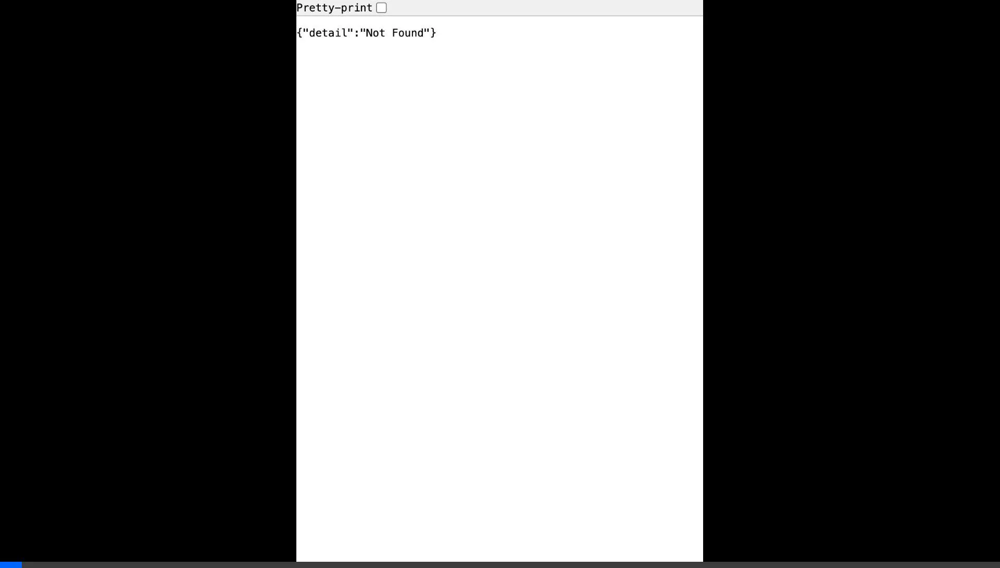

# Agent-First Zero-Trust Gateway



**A high-performance, intent-aware proxy designed to secure Autonomous AI Agents in production.**

Traditional AI Firewalls (like NeMo Guardrails or Presidio) focus on "Chatbots"—they block toxic text or redact PII from prompts. 

But the future is **Autonomous Agents**. Agents don't just chat; they use tools to execute code, search the web, and wipe out databases. The Agent-First Gateway is an API proxy that intercepts these agent `tool_calls`, evaluates the *intent* of the parameters, and blocks destructive actions (like `rm -rf` or `DROP TABLE`) before they ever reach your servers.

If a tool is blocked, the gateway seamlessly injects a synthetic error message back into the AI's context window, allowing the agent to gracefully adapt without breaking your application loop.

> For a deep dive into the architectural theory, read the [Agent-First Zero-Trust Gateway Whitepaper](WHITEPAPER.md).

---

## Key Features
- **Zero-Latency Network Native:** Sits transparently between your application and the Anthropic API.
- **Intent-Based Tool Interception:** Parses the JSON schemas of pending tool calls in real time.
- **Graceful Denials:** Instead of crashing your app, blocked tools inject synthetic reasoning back to the LLM (e.g. `[GATEWAY SECURITY BLOCK]: Execution of 'run_bash' was denied: Blocked bash command detected: rm -rf`).
- **Real-Time Security Dashboard:** A beautifully designed frontend visualization of all intercepted AI traffic.
- **JSON-Lines Audit Logging:** Complete forensic tracking of what your agents attempted to accomplish.

---

## Installation & Setup

### Prerequisites
- Python 3.9+
- An Anthropic API Key

### 1. Clone & Install
```bash
git clone https://github.com/YOUR_USERNAME/Agent-Gateway.git
cd Agent-Gateway
python3 -m venv venv
source venv/bin/activate
pip install -r requirements.txt
```
*(If `requirements.txt` is missing, you can install the core packages manually: `pip install fastapi uvicorn httpx python-dotenv anthropic`)*

### 2. Configure Credentials
Create a `.env` file in the root directory and add your Anthropic API Key:
```bash
ANTHROPIC_API_KEY=sk-ant-your-api-key-here
```

### 3. Start the Gateway
Run the proxy and dashboard server:
```bash
python -m uvicorn main:app --host 0.0.0.0 --port 8000
```

### 4. View the Live Dashboard
Open your browser and navigate to:
```url
http://localhost:8000/
```

---

## How to Test the Interceptor

The repository includes a simulation script (`test_gateway.py`) that uses the official Anthropic SDK, but points traffic through our local proxy.

**Test a Safe Tool Call:**
```bash
python test_gateway.py --test safe
```
*The gateway will pass the `get_weather` tool request and log a green 'Passed' event on the dashboard.*

**Test a Malicious intent (Blocked):**
```bash
python test_gateway.py --test unsafe
```
*The simulation forces Claude to output a destructive bash tool intent (`rm -rf /var/log`). The Gateway will intercept the JSON, strip the tool from the execution queue, and return a synthetic security denial. A red 'Blocked' event will instantly hit the dashboard.*

---

## Future Roadmap
- [ ] Port to **Go/Rust** for sub-millisecond wire latency.
- [ ] Replace hardcoded Regex Policies with an embedded **1B parameter Local Model (SLM)** to evaluate obfuscated tool constraints natively on the edge.
- [ ] Add PostgreSQL integration for dashboard log pagination.

## License
MIT Open Source. Please use responsibly to keep your agents safe.
